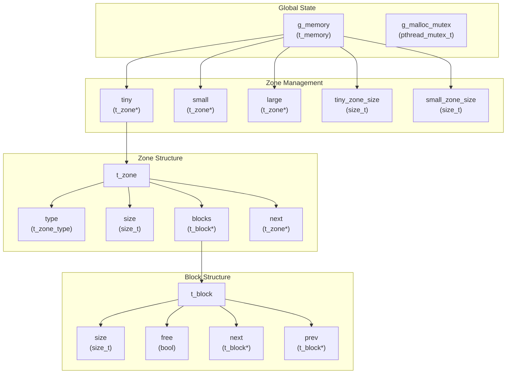
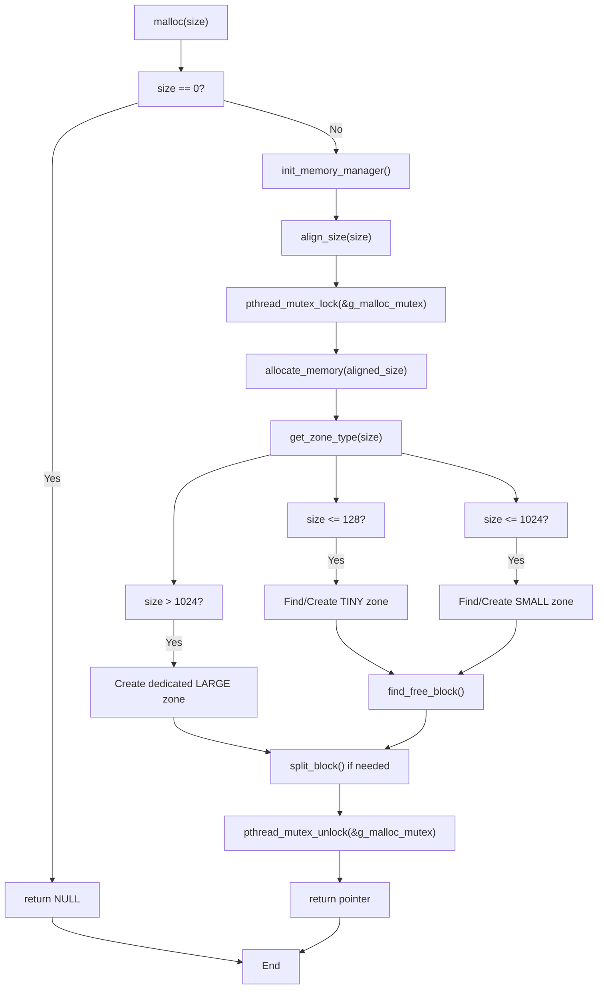
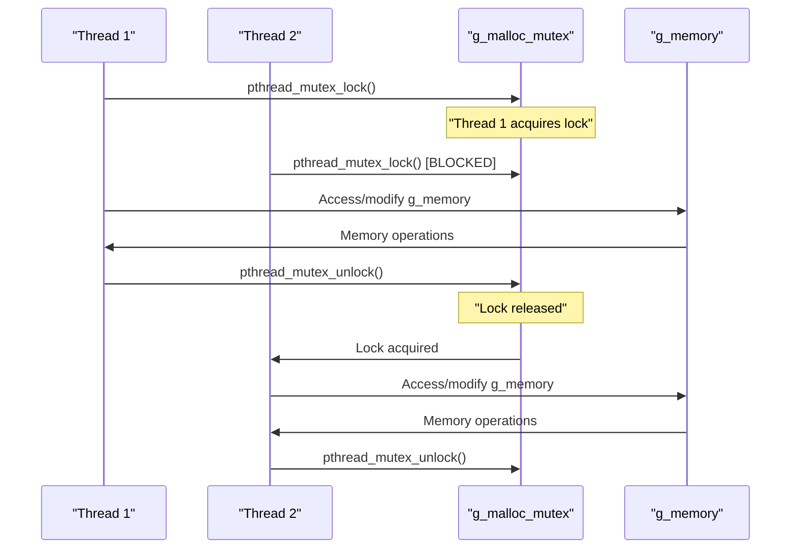

# Custom Malloc Implementation

> A zone-based memory allocator with enhanced debugging capabilities and thread safety

## Overview

This document provides a comprehensive introduction to the custom malloc implementation repository, explaining its zone-based memory management architecture, thread safety mechanisms, and build system. The implementation provides drop-in replacements for the standard C library memory allocation functions (`malloc`, `free`, `realloc`) with enhanced debugging capabilities and optimized memory organization.

### Related Files
- [`includes/malloc.h`](includes/malloc.h) - Header definitions and structure declarations
- [`src/malloc.c`](src/malloc.c) - Main implementation file

## Purpose and Design Goals

This custom malloc implementation is designed to replace the system's default memory allocator with a zone-based approach that categorizes allocations by size to reduce fragmentation and improve performance. The allocator organizes memory into three distinct zones:

- **TINY zones**: Handle allocations ≤ 128 bytes
- **SMALL zones**: Handle allocations ≤ 1024 bytes  
- **LARGE zones**: Handle allocations > 1024 bytes

The implementation prioritizes thread safety through a global mutex, memory safety through pointer validation, and debugging support through comprehensive allocation tracking and reporting functions.

## Core Data Structures

The malloc implementation centers around several key data structures that manage memory zones and allocation blocks:



The `t_memory` structure serves as the global state manager, containing linked lists for each zone type and precalculated zone sizes. Each `t_zone` represents a memory region obtained via `mmap`, while `t_block` structures track individual allocations within zones using a doubly-linked list.

## Memory Allocation Flow

The allocation process follows a structured approach that classifies requests by size and manages them through appropriate zone types:



The flow demonstrates how the allocator maintains thread safety through mutex protection while efficiently routing requests to appropriate zone types based on size thresholds defined in the header file.

## Key System Components

The malloc implementation is organized into several focused modules, each handling specific aspects of memory management:

| Component | Primary Functions | Responsibility |
|-----------|------------------|----------------|
| **malloc.c** | `malloc()`, `free()`, `init_memory_manager()` | Main API interface and thread synchronization |
| **malloc_core.c** | `allocate_memory()`, `free_memory()` | Core allocation logic and zone routing |
| **zones.c** | `create_zone()`, `add_zone()`, `get_zone_type()` | Zone lifecycle management |
| **blocks.c** | `find_free_block()`, `split_block()`, `coalesce_blocks()` | Block-level operations within zones |
| **validation.c** | `is_valid_pointer()` | Pointer safety and corruption detection |
| **malloc_helpers.c** | `realloc()` implementation | Memory expansion and copying logic |

The modular design enables clear separation of concerns while maintaining efficient communication between components through the shared global state.

## Thread Safety Architecture

The implementation ensures thread safety through a single global mutex that serializes all memory operations:



This approach trades potential parallelism for simplicity and correctness, ensuring that all modifications to the global memory state are atomic and preventing race conditions in zone and block management operations.

## Build System and Distribution

The project builds as a shared library that can replace the system malloc through dynamic loading. The build process generates host-specific libraries to ensure compatibility:

- **Build Target**: `libft_malloc_$(HOSTTYPE).so`
- **Generic Link**: `libft_malloc.so`
- **Installation**: Dynamic library injection via `DYLD_INSERT_LIBRARIES` (macOS) or `LD_PRELOAD` (Linux)
- **Testing**: Automated test suite using library injection to validate functionality

The shared library approach allows the custom malloc to be used with existing applications without recompilation, making it suitable for both development and production debugging scenarios.

### Building the Project

```bash
# Build the library
make

# Run tests
make test

# Clean build artifacts
make clean
```

### Usage

```bash
# Linux
export LD_PRELOAD="./libft_malloc.so"
./your_program

# macOS
export DYLD_INSERT_LIBRARIES="./libft_malloc.so"
./your_program
```

## API Reference

### Memory Allocation Functions

The implementation provides standard C library compatible functions:

- `void* malloc(size_t size)` - Allocate memory block
- `void free(void* ptr)` - Free allocated memory
- `void* realloc(void* ptr, size_t size)` - Resize memory block

### Debugging and Monitoring

Additional debugging functions are provided:

- `void show_alloc_mem(void)` - Display current allocation status
- Memory statistics tracking and reporting

## Key Features Summary

| Feature | Implementation | Benefit |
|---------|---------------|---------|
| **Zone-based allocation** | Three size categories with optimized zone layouts | Reduced fragmentation, improved locality |
| **Thread safety** | Global mutex protection | Simple, correct concurrent access |
| **Memory validation** | Pointer checking before operations | Enhanced safety, corruption detection |
| **Debugging support** | `show_alloc_mem()`, statistics tracking | Development and debugging assistance |
| **Drop-in replacement** | Standard malloc/free/realloc API | Easy integration with existing code |
| **System memory management** | `mmap`/`munmap` for underlying allocation | Direct system integration, page alignment |

The implementation balances performance, safety, and debugging capabilities while maintaining compatibility with standard C memory allocation patterns.

## Testing and Development

The project includes comprehensive testing infrastructure:

- Unit tests for individual components
- Integration tests for complete allocation scenarios
- Memory leak detection
- Thread safety validation
- Performance benchmarking

## Contributing

1. Fork the repository
2. Create a feature branch
3. Make your changes
4. Add tests for new functionality
5. Ensure all tests pass
6. Submit a pull request

## License

This project is part of a school assignment and follows educational use guidelines.

---

For detailed implementation specifics, see the individual section documentation:
- [Getting Started](docs/getting-started.md)
- [Core Architecture](docs/core-architecture.md)
- [API Reference](docs/api-reference.md)
- [Implementation Details](docs/implementation-details.md)
